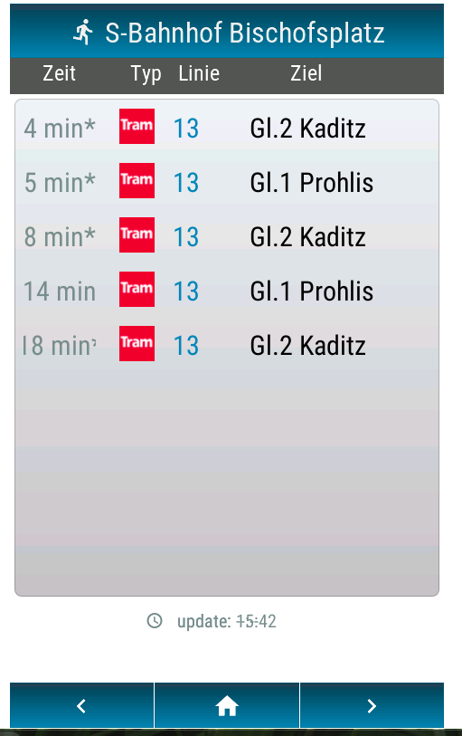
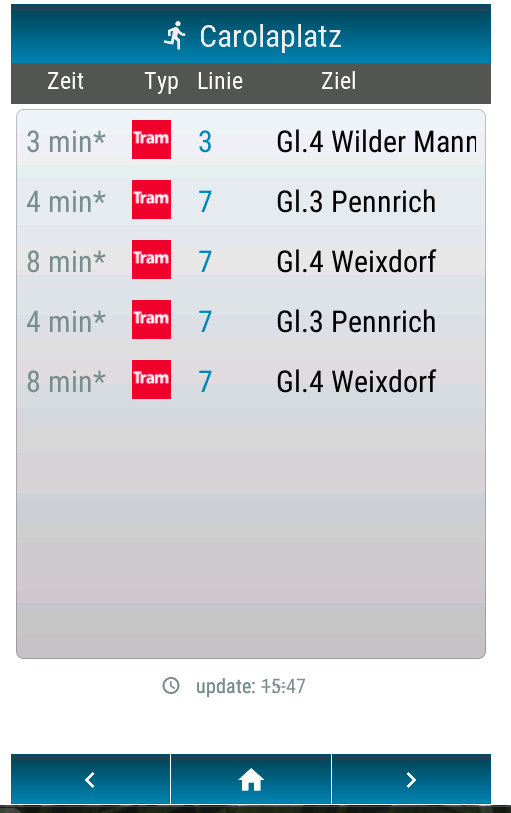
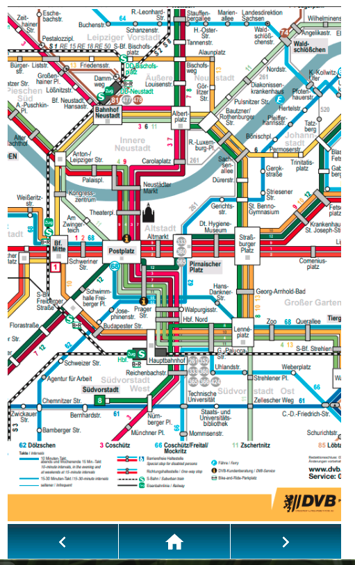

Install MQTT Broker

setup openhasp 

	https://nightly.openhasp.com/
	install

minicom to display and set WIFI:
	
	ssid myAccessPointName 
	pass myWifiPassword 
	reboot
	
getting display IP
copy openhasp_data to display with Webinterface 

install uv (falls noch nicht geschehen) 
```bash

   curl -LsSf https://astral.sh/uv/install.sh | sh
	 #source $HOME/.cargo/env	
   
	 # uv init 
	 # uv add requests paho-mqtt
   
	 uv sync
        
     ENV_FILE=willi.env docker compose --env-file willi.env up -d
```
  
<p align="center">
  
  
  
</p>


